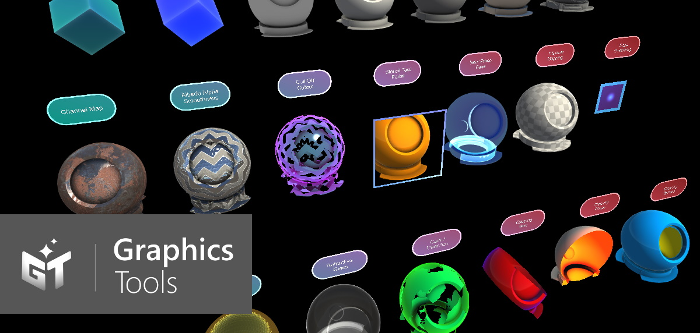
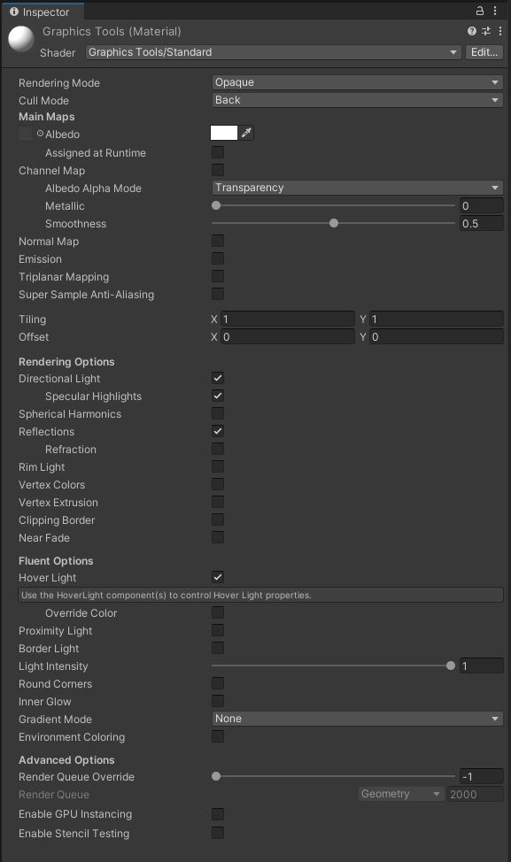
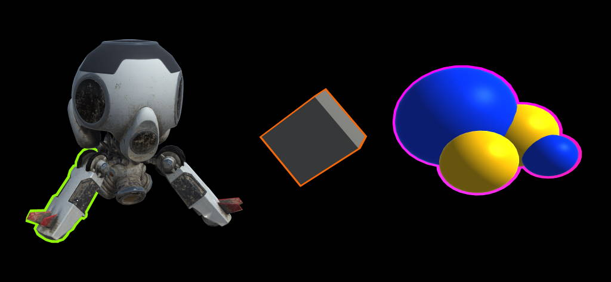
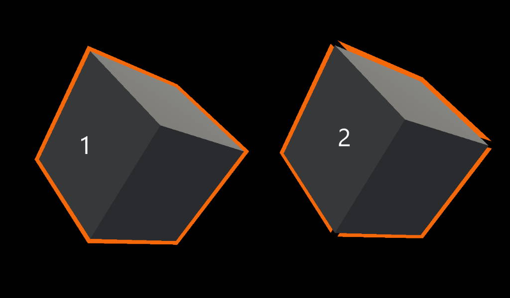
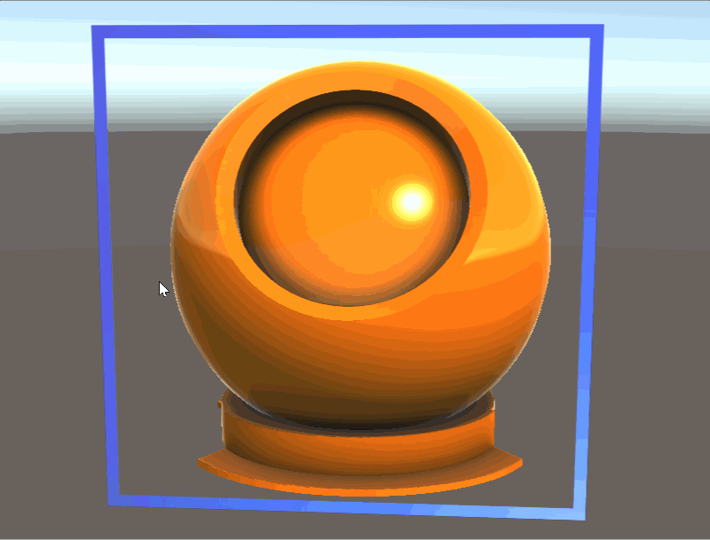

# Graphics tools standard shader

The Graphics Tools Standard shading system utilizes a single, flexible shader that can achieve visuals similar to Unity's Standard Shader, implement [Fluent Design System](https://www.microsoft.com/design/fluent/) principles, and remain performant on mixed reality devices.

## Architecture

The Graphics Tools/Standard shading system is an "uber shader" that uses [Unity's shader program variant feature](https://docs.unity3d.com/Manual/SL-MultipleProgramVariants.html) to auto-generate optimal shader code based on material properties. When a user selects material properties in the material inspector, they only incur performance cost for features they have enabled.

## Material inspector

A custom material inspector exists for the Graphics Tools/Standard shader called `StandardShaderGUI.cs`. The inspector automatically enables/disables shader features, based on user selection and aides in setting up render state. For more information about each feature **please hover over each property in the Unity Editor for a tooltip.**

The first portion of the inspector controls the material's render state. *Rendering Mode* determines when and how a material will be rendered. The aim of the Graphics Tools/Standard shader is to mirror the [rendering modes found in the Unity/Standard shader](https://docs.unity3d.com/Manual/StandardShaderMaterialParameterRenderingMode.html). The Graphics Tools/Standard shader also includes an *Additive* rendering mode and *Custom* rendering mode for complete user control.

| Rendering Mode |         Description                                                       |
|----------------|---------------------------------------------------------------------------|
| Opaque         | (Default) Suitable for normal solid objects with no transparent areas.    |
| Cutout         | Allows creation of transparent effects that have hard edges between the opaque and transparent areas. In this mode, there are no semi-transparent areas, the texture is either 100% opaque, or invisible. This is useful when using transparency to create the shape of materials, such as vegetation. |
| Fade           | Allows the transparency values to entirely fade an object out, including any specular highlights or reflections it may have. This mode is useful if you want to animate an object fading in or out. It is not suitable for rendering realistic transparent materials such as clear plastic or glass because the reflections and highlights will also be faded out. |
| Transparent    | Suitable for rendering realistic transparent materials such as clear plastic or glass. In this mode, the material itself will take on transparency values (based on the texture’s alpha channel and the alpha of the tint colour). However, reflections and lighting highlights will remain visible at full clarity as is the case with real transparent materials. |
| Additive       | Enables an additive blending mode, which sums the previous pixel color with the current pixel color. This is the preferred transparency mode to avoid transparency sorting issues.     |
| Custom         | Allows for every aspect of the rendering mode to be controlled manually. For advanced usage only.   |

| Cull Mode |             Description                                                                                                                                                                       |
|-----------|------------------------------------------------------------------------------------------------------------------------------------------------------------------------------------|
| Off       | Disables face culling. Culling should only be set to Off when a two sided mesh is required.                                                                                        |
| Front     | Enables front face culling.                                                                                                                                                        |
| Back      | (Default) Enables [back face culling](https://en.wikipedia.org/wiki/Back-face_culling). Back face culling should be enabled as often as possible to improve rendering performance. |

## Performance

One of the primary advantages to using the Graphics Tools Standard shader over the Unity standard shader is performance. The Graphics Tools Standard Shader is extensible to only utilize the features enabled. However, the Graphics Tools Standard shader has also been written to deliver comparable aesthetic results as the Unity Standard shader, but at a much lower cost. One simple way to compare shader performance is via the number of operations that needs to be performed on the GPU. Of course, the magnitude of calculations may fluctuate by features enabled and other rendering configurations. But, in general, the Graphics Tools Standard shader performs significantly less computation than the Unity Standard shader.

## Lighting

The Graphics Tools/Standard shader uses a simple approximation for lighting. Because this shader does not calculate for physical correctness and energy conservation, it renders quickly and efficiently. Blinn-Phong is the primary lighting technique which is blended with Fresnel and image-based lighting to approximate physically-based lighting. The shader supports the following lighting techniques:

### Directional light

The shader will respect the direction, color, and intensity of the first Unity Directional Light in the scene (if enabled). Dynamic point lights, spot lights, or any other Unity light will not be considered in real time lighting.

### Spherical harmonics

The shader will use Light Probes to approximate lights in the scene using [Spherical Harmonics](https://docs.unity3d.com/Manual/LightProbes-TechnicalInformation.html), if enabled. Spherical harmonics calculations are performed per vertex to reduce calculation cost.

### Lightmapping

For static lighting, the shader will respect lightmaps built by Unity's [Lightmapping system](https://docs.unity3d.com/Manual/Lightmapping.html). Simply mark the renderer as static (or lightmap static) to use lightmaps.

## UGUI support

The Graphics Tools Standard shading system works with Unity's built in [UI system](https://docs.unity3d.com/Manual/UISystem.html). On Unity UI components, the unity_ObjectToWorld matrix is not the transformation matrix of the local transform the Graphic component lives on but that of its parent Canvas. Many Graphics Tools/Standard shader effects require object scale to be known. To solve this issue, the `ScaleMeshEffect.cs` will store scaling information into UV channel attributes during UI mesh construction.

Note, when using a Unity Image component, it is recommended to specify "None (Sprite)" for the Source Image to prevent Unity UI from generating extra vertices.

A Canvas within Graphics Tools will prompt for the addition of a `ScaleMeshEffect.cs` when one is required:

## Texture combining

To improve parity with the Unity Standard shader per pixel metallic, smoothness, emissive, and occlusion values can all be controlled via [channel packing](http://wiki.polycount.com/wiki/ChannelPacking). For example:

When you use channel packing, you only have to sample and load one texture into memory instead of four separate ones. When you write your texture maps in a program like Substance or Photoshop, you can hand pack them like the following:

| Channel | Property             |
|---------|----------------------|
| Red     | Metallic             |
| Green   | Occlusion            |
| Blue    | Emission (Greyscale) |
| Alpha   | Smoothness           |

## Additional feature documentation

Below are extra details on a handful of feature details available with the Graphics Tools/Standard shader.

### Mesh outlines

Many mesh outline techniques are done using a [post processing](https://docs.unity3d.com/Manual/PostProcessingOverview.html) technique. Post processing provides great quality outlines, but can be prohibitively expensive on many Mixed Reality devices.

`MeshOutline.cs` and `MeshOutlineHierarchy.cs` can be used to render an outline around a mesh renderer. Enabling this component introduces an additional render pass of the object being outlined, but is designed to run performantly on mobile Mixed Reality devices and does not utilize any post processes. Limitations of this effect include it not working well on objects which are not watertight (or required to be two sided) and depth sorting issues can occur on overlapping objects.

The outline behaviors are designed to be used in conjunction with the Graphics Tools/Standard shader. Outline materials are usually a solid unlit color, but can be configured to achieve a wide array of effects. The default configuration of a outline material is as follows:

1. Depth Write - should be disabled for outline materials to make sure the outline does not prevent other objects from rendering.
2. Vertex Extrusion - needs to be enabled to render the outline.
3. Use Smooth Normals - this setting is optional for some meshes. Extrusion occurs by moving a vertex along a vertex normal, on some meshes extruding along the default normals will cause discontinuities in the outline. To fix these discontinuities, you can check this box to use another set of smoothed normals which get generated by `MeshSmoother.cs`.

`MeshSmoother.cs` is a component which can be used to automatically generate smoothed normals on a mesh. This method groups vertices in a mesh that share the same location in space then averages the normals of those vertices. This process creates a copy of the underlying mesh and should be used only when required.

1. Smooth normals generated via `MeshSmoother.cs`.
2. Default normals used, notice the artifacts around the cube corners.

### Stencil testing

Built in configurable stencil test support to achieve a wide array of effects. Such as portals:

### Instanced color support

Instanced color support to give thousands of GPU instanced meshes unique material properties:

### Triplanar mapping

Triplanar mapping is a technique to programmatically texture a mesh. Often used in terrain, meshes without UVs, or difficult to unwrap shapes. This implementation supports world or local space projection, the specification of blending smoothness, and normal map support. Note, each texture used requires 3 texture samples, so use sparingly in performance critical situations.

### Vertex extrusion

Vertex extrusion in world space. Useful for visualizing extruded bounding volumes or transitions in/out meshes.

A checkbox to control albedo optimizations. As an optimization albedo operations are disabled when no albedo texture is specified. This is useful for controlling [remote texture loading](http://dotnetbyexample.blogspot.com/2018/10/workaround-remote-texture-loading-does.html).

Simply check this box:

## See also

* [Hover Light](HoverLight.md)
* [Proximity Light](ProximityLight.md)
* [Clipping Primitive](ClippingPrimitive.md)
