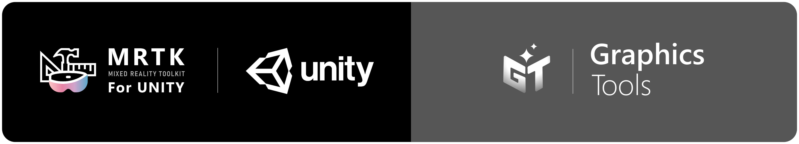
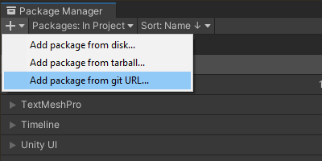
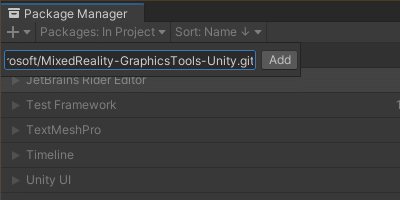
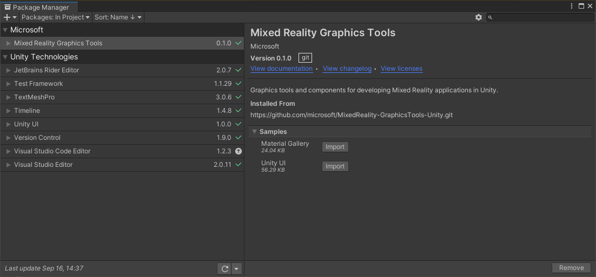
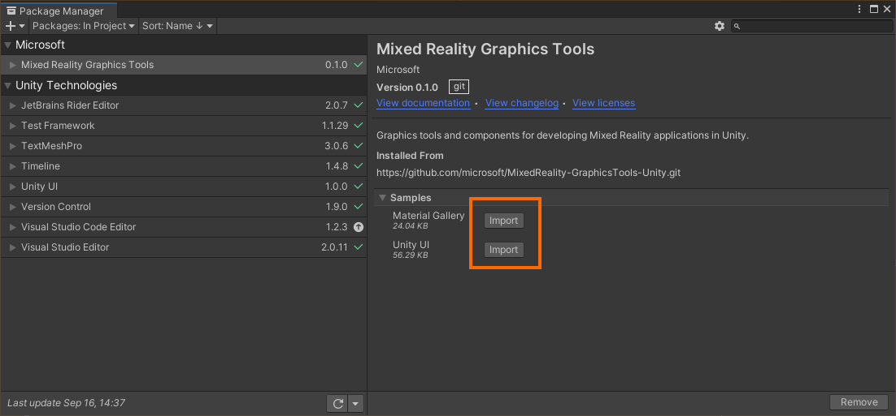

# What is Graphics Tools

Graphics tools and components for developing Mixed Reality applications in Unity. 

> **_NOTE:_** This repo is a **work in progress** fork of the [MRTK/Standard shader system](https://docs.microsoft.com/en-us/windows/mixed-reality/mrtk-unity/features/rendering/mrtk-standard-shader?view=mrtkunity-2021-05) and other components. The equivalent of the `MRTK/Standard` shader within Graphics Tools is the `Graphics Tools/Standard` shader.

# Getting started with Graphics Tools

Graphics Tools is designed to be imported as a [Unity package](https://docs.unity3d.com/Manual/Packages.html). 

> **_NOTE:_** Graphics Tools requires Unity 2020.x and above.

To import Graphics Tools into your Unity project follow the below steps:

1. Open your Unity project and select `Window > Package Manager` from the file menu bar
2. Click the `'+'` icon within the Package Manager and select `"Add package from git URL..."`

3. Paste `https://github.com/microsoft/MixedReality-GraphicsTools-Unity.git` into the text field and click `"Add"`

4. Graphics Tools will now be installed within your Unity project as an immutable package.

> **_NOTE:_** If you would like a specific release of the Graphics Tools package please navigate to the [releases page](https://github.com/microsoft/MixedReality-GraphicsTools-Unity/releases) and append the desired release tag onto the URL in step 3. For example, to download the [v0.1.0](https://github.com/microsoft/MixedReality-GraphicsTools-Unity/releases/tag/v0.1.0) release you would specify: `https://github.com/microsoft/MixedReality-GraphicsTools-Unity.git#v0.1.0`

## Importing samples

To open the samples contained within Graphics Tools expand the `"Samples"` list and click the `"Import"` button for any samples you would like to try:

Samples will import into your project's Assets folder so they may be opened and modified.

## Documentation

| | | | |
| :------------- | :----------: | -----------: | -----------: | 
| [Standard Shader](Documentation~/StandardShader.md) | [Clipping Primitive](Documentation~/ClippingPrimitive.md) | [Proximity Light](Documentation~/ProximityLight.md) | [Hover Light](Documentation~/HoverLight.md) | 
| [Material Instance](Documentation~/MaterialInstance.md) | [Animation](Documentation~/Animation.md) | | | 

## Contributing

### Updating samples

By default assets exist under the `Samples~` subfolder as outlined by Unity's [sample recommendations](https://docs.unity3d.com/Manual/cus-samples.html). The '~' character prevents the `Samples~` folder for being imported by Unity. This is ideal when including the package via the package manager. But, not when you want to update the samples *within* the package. 

If you wish to contribute changes to the samples you must make a temporary local change to the Unity project's directory structure.

1. [Fork](https://docs.github.com/en/get-started/quickstart/fork-a-repo) and [clone](https://docs.github.com/en/repositories/creating-and-managing-repositories/cloning-a-repository) this [repository](https://github.com/microsoft/MixedReality-GraphicsTools-Unity.git).
2. Open the Graphics Tools project in Unity. The `Samples` folder will not be visible by default. To show the samples select `Window > Graphics Tools > Show Samples` from the file menu bar.
3. Make any desired changes to the samples.
4. **Important:** When finished and before committing your changes, remember to hide the samples. Select `Window > Graphics Tools > Hide Samples` from the file menu bar.
5. [Commit and push](https://docs.github.com/en/get-started/using-git/pushing-commits-to-a-remote-repository) your changes to your fork and open a [pull request](https://github.com/microsoft/MixedReality-GraphicsTools-Unity/pulls).

### License agreement 

This project welcomes contributions and suggestions.  Most contributions require you to agree to a
Contributor License Agreement (CLA) declaring that you have the right to, and actually do, grant us
the rights to use your contribution. For details, visit https://cla.opensource.microsoft.com.

When you submit a pull request, a CLA bot will automatically determine whether you need to provide
a CLA and decorate the PR appropriately (e.g., status check, comment). Simply follow the instructions
provided by the bot. You will only need to do this once across all repos using our CLA.

This project has adopted the [Microsoft Open Source Code of Conduct](https://opensource.microsoft.com/codeofconduct/).
For more information see the [Code of Conduct FAQ](https://opensource.microsoft.com/codeofconduct/faq/) or
contact [opencode@microsoft.com](mailto:opencode@microsoft.com) with any additional questions or comments.

## Trademarks

This project may contain trademarks or logos for projects, products, or services. Authorized use of Microsoft 
trademarks or logos is subject to and must follow 
[Microsoft's Trademark & Brand Guidelines](https://www.microsoft.com/en-us/legal/intellectualproperty/trademarks/usage/general).
Use of Microsoft trademarks or logos in modified versions of this project must not cause confusion or imply Microsoft sponsorship.
Any use of third-party trademarks or logos are subject to those third-party's policies.
