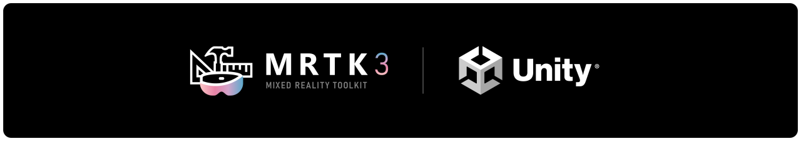
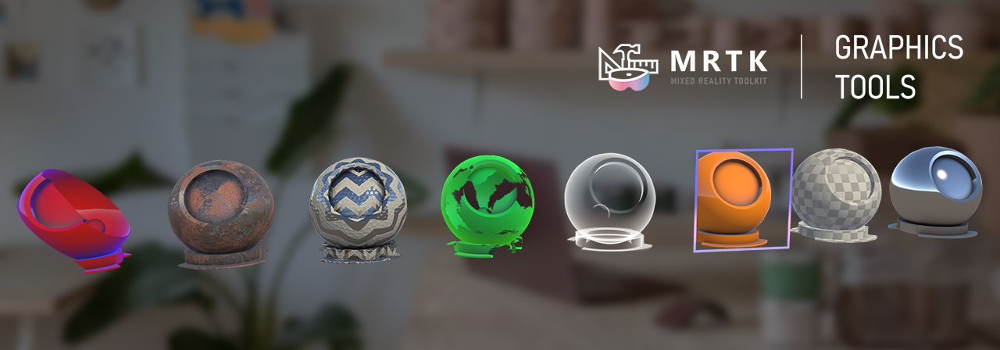
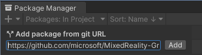
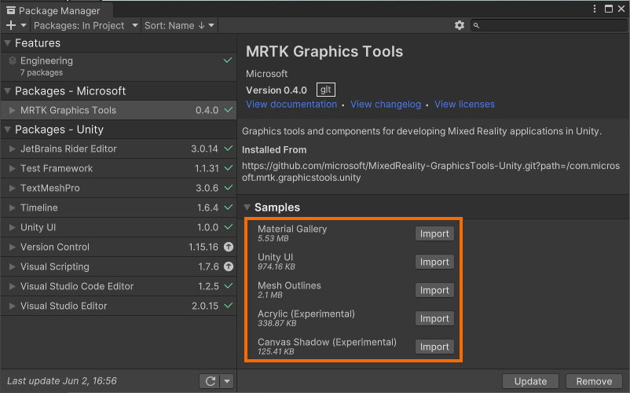

# What is Graphics Tools?

MRTK Graphics Tools for Unity is a [Unity engine](https://unity.com/) package with code, shaders, assets, and samples created to help improve the visual fidelity of [mixed reality](https://docs.microsoft.com/windows/mixed-reality/discover/mixed-reality) applications while staying within performance budgets.

# Getting started with Graphics Tools

Graphics Tools is normally ingested as a Unity [package](https://docs.unity3d.com/Manual/Packages.html). To import Graphics Tools into your Unity project follow the below steps:

> [!NOTE]
> The Graphics Tools package requires Unity 2020.x and above.

1. Open your Unity project and select `Window > Package Manager` from the file menu bar

2. Click the `'+'` icon within the Package Manager and select `"Add package from git URL..."`

    

3. Paste `https://github.com/microsoft/MixedReality-GraphicsTools-Unity.git?path=/com.microsoft.mrtk.graphicstools.unity#v0.4.0` into the text field and click `"Add"`

    

4. Graphics Tools will now be installed within your Unity project as an immutable package within the project's `Packages` folder named `MRTK Graphics Tools`.

It is advised you use a specific release of the Graphics Tools package to ensure your project is locked to a stable release. Release version 0.4.0 is suggested in step three above. You can also pull another version, specific branch, or git commit hash by altering the URL as demonstrated below:

| Syntax           | URL example                                                                                                                                               |
|------------------|-----------------------------------------------------------------------------------------------------------------------------------------------------------|
| Specific version | `https://github.com/microsoft/MixedReality-GraphicsTools-Unity.git?path=/com.microsoft.mrtk.graphicstools.unity#vX.Y.Z`                                   |
| Specific branch  | `https://github.com/microsoft/MixedReality-GraphicsTools-Unity.git?path=/com.microsoft.mrtk.graphicstools.unity#my_branch`                                |
| Git commit hash  | `https://github.com/microsoft/MixedReality-GraphicsTools-Unity.git?path=/com.microsoft.mrtk.graphicstools.unity#badc0ffee0ddf00ddead10cc8badf00d1badb002` |

## Documentation

Documentation can be found on Microsoft's technical documentation website.

| Documentation Category | Link                                                                                                               |
|------------------------|--------------------------------------------------------------------------------------------------------------------|
| Conceptual             | [MRTK Unity](https://docs.microsoft.com/windows/mixed-reality/mrtk-unity/)                                         |
| API Reference          | [Microsoft.MixedReality.GraphicsTools](https://docs.microsoft.com/dotnet/api/Microsoft.MixedReality.GraphicsTools) |

## Importing samples

To view the samples contained within Graphics Tools select `Window > Package Manager` from the Unity file menu bar. Click on the `MRTK Graphics Tools` package and expand the `Samples` list. Finally, click the `Import` button for any samples you would like to try:

## Example project

A Unity project named `GraphicsToolsUnityProject` lives at the root of this repository. The project serves as sandbox to test and validate the Graphics Tools package. This project can also assist in developing contributions to this repo. See [below](#updating-the-package-samples) to learn more about contributing.

> [!TIP]
> See GraphicsToolsUnityProject/ProjectSettings/ProjectVersion.txt to inspect the Unity version used for the example project.

# Feedback and contributions

This project welcomes contributions and suggestions.  Most contributions require you to agree to a
Contributor License Agreement (CLA) declaring that you have the right to, and actually do, grant us
the rights to use your contribution. For details, visit <https://cla.opensource.microsoft.com>.

When you submit a pull request, a CLA bot will automatically determine whether you need to provide
a CLA and decorate the PR appropriately (e.g., status check, comment). Simply follow the instructions
provided by the bot. You will only need to do this once across all repos using our CLA.

This project has adopted the [Microsoft Open Source Code of Conduct](https://opensource.microsoft.com/codeofconduct/).
For more information see the [Code of Conduct FAQ](https://opensource.microsoft.com/codeofconduct/faq/) or
contact [opencode@microsoft.com](mailto:opencode@microsoft.com) with any additional questions or comments.

## Updating the package samples

Samples exist under the `Samples~` subfolder as outlined by Unity's [sample recommendations](https://docs.unity3d.com/Manual/cus-samples.html). The '~' character prevents the `Samples~` folder for being imported by Unity.

If you wish to contribute changes to the samples you must make a temporary local change to the Unity project's directory structure.

1. Open the `GraphicsToolsUnityProject` in Unity. The `Samples` folder will not be visible in the `MRTK Graphics Tools` package by default. To show the samples select `Window > Graphics Tools > Show Samples` from the file menu bar.
2. Make any desired changes to the samples.
3. **Important:** When finished and before committing your changes, remember to hide the samples. Select `Window > Graphics Tools > Hide Samples` from the file menu bar.

# License agreement

This project welcomes contributions and suggestions.  Most contributions require you to agree to a
Contributor License Agreement (CLA) declaring that you have the right to, and actually do, grant us
the rights to use your contribution. For details, visit <https://cla.opensource.microsoft.com>.

When you submit a pull request, a CLA bot will automatically determine whether you need to provide
a CLA and decorate the PR appropriately (e.g., status check, comment). Simply follow the instructions
provided by the bot. You will only need to do this once across all repos using our CLA.

This project has adopted the [Microsoft Open Source Code of Conduct](https://opensource.microsoft.com/codeofconduct/).
For more information see the [Code of Conduct FAQ](https://opensource.microsoft.com/codeofconduct/faq/) or
contact [opencode@microsoft.com](mailto:opencode@microsoft.com) with any additional questions or comments.
